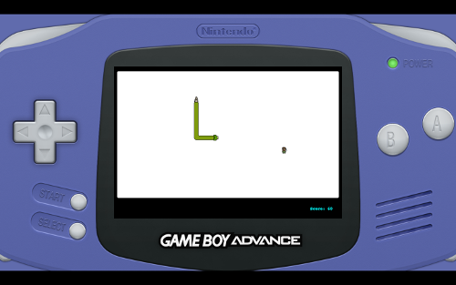

# WDI-Project-1
### Aaron Jeffrey-Hall

You can play the game [here](https://snake-vs-snake.herokuapp.com/)  

##Overview
The first project in the WDI course. The task was to create a game using the knowledge that I had gained in the first 2 weeks.

##Aim
To demonstrate how much I have learnt so far and to practice using my skills in order to have a playable game that is hosted on the internet.

##My game
For this task I decided to create a simple snake-like game. The object of this game is to move your snake over the prey to grow larger, so that your snake can be as long as possible. I've also included a two player mode so that there can be competition on the same screen.

##Controls
- Arrowkeys to move in singleplayer or for player one in two player.
- WASD keys to move the second player in two player.
- P key pauses.
- [ key resumes.
- R key restarts after game over.
- M key mutes the background music.
- N key unmutes muted music.

##Challenges
- Making the game respond to collisions between the snake and itself aswell as the borders.
- Making the images for the tail of the snake change at the correct time so the snake stay as one.
- Getting the css to style the layout of the page how I wanted

##Possible improvements
- Making the Javascript Object Orientated.
- Extras in single player mode such as walls or increasing speed.
- More unique sounds.
- Adding controller support.
- Making the M key both mute and unmute.
- Adding the ability to play from the keys on the gameboy advance image.
- Allowing different difficulties in singleplayer mode.
- Fixing all bugs.

##Bugs
If both players in two player mode approach each other perpendicularly at exactly the right time then they can slide through each other.
